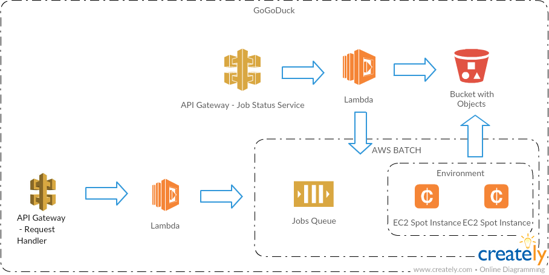

AWS/WPS HIIIIIIIHIIIIIHELLLOOOHIIII
=======

Project to build components for an [OGC Web Processing Service](http://www.opengeospatial.org/standards/wps) providing NetCDF aggregation services on AWS   

### When deployed to AWS



### Components built using this project

#### Request Handler

Lambda function that handles OGC WPS requests
  - GetCapabilites - describes services provided
  - DescribeProcess - describes supported aggregation processes
  - Execute - submits an aggregation request to AWS Batch

#### Aggregation worker

Docker image that performs the actual aggregation.  Its whats run on the EC2 instance.

#### Job Status service

Lambda function that handles job status requests.
 
### In this project

- ```doc``` supporting documentation files
- ```request-handler```  a maven sub-module to build the lambda deployment package for the request handler
- ```aggregation-worker``` a maven sub-module to build the docker image for the aggregation worker.
- ```job-status-service``` a maven sub-module to build the lambda deployment package for the job status service
- ```integration-tests``` a maven project that can be used to integration test a deployed AWS/WPS instance at a 
location specified by the WPS_ENDPOINT environment variable    
- ```requests``` contains a demo request that can be submitted to a deployed AWS/WPS instance
- ```wps-cloudformation-template.yaml``` a cloud formation template for creating AWS components of the AWS/WPS instance

### Supported aggregation processes

 * [gs:GoGoDuck - gridded data aggregator](doc/GoGoDuck.md)
 
### Limitations

Only OGC WPS features required to support the Portal/MARVL have been implemented. 
The following mandatory features from the spec are not supported:

 - loading inputs from web accessible resources
 - synchronous processing
 - encoding outputs in response
 - raw data output
 
### To Build

Requirements:
 
  * maven 3
  * java 8
  * docker

```
$ mvn clean package
```

### To run integration tests

Set the WPS_ENDPOINT environment variable to the service url for then use mvn verify in the integration-tests directory
to run the tests.  For example for the service url 'https://wps-testing.dev.aodn.org.au/wps' the following will 
run integration tests against that endpoint.

```
$ cd integration-tests
$ WPS_ENDPOINT='https://wps-testing.dev.aodn.org.au/wps' mvn verify
```
### To submit a request

A sample request and a script to submit it can be found in the requets directory.   The submit script should be modified
 to submit the request the to the required service url. 

    
### Deployment Pipeline/Process

TBC
